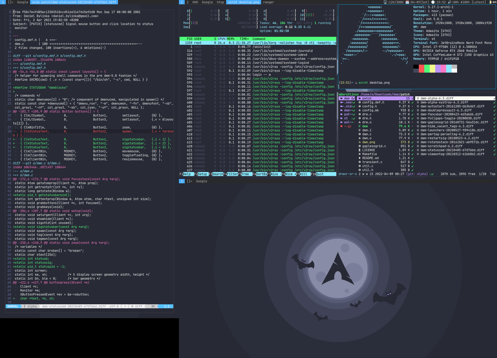

## DWM
这是我编译的`dwm`，补丁完美无冲突。

默认分支`master`并没有透明效果，如果想要透明效果可使用`alpha`分支。

## 补丁列表

- [dwm-autostart-20161205-bb3bd6f.diff](./patch/dwm-autostart-20161205-bb3bd6f.diff)
- [dwm-doublepressquit-6.3.diff](./patch/dwm-doublepressquit-6.3.diff)
- [dwm-fancybar-20200423-ed3ab6b.diff](./patch/dwm-fancybar-20200423-ed3ab6b.diff)
- [dwm-fullgaps-toggle-20200830.diff](./patch/dwm-fullgaps-toggle-20200830.diff)
- [dwm-gaplessgrid-20160731-56a31dc.diff](./patch/dwm-gaplessgrid-20160731-56a31dc.diff)
- [dwm-hide_vacant_tags-6.3.diff](./patch/dwm-hide_vacant_tags-6.3.diff)
- [dwm-launchers-20200527-f09418b.diff](./patch/dwm-launchers-20200527-f09418b.diff)
- [dwm-pertag-perseltag-6.2.diff](./patch/dwm-pertag-perseltag-6.2.diff)
- [dwm-restartsig-20180523-6.2.diff](./patch/dwm-restartsig-20180523-6.2.diff)
- [dwm-rotatestack-20161021-ab9571b.diff](./patch/dwm-rotatestack-20161021-ab9571b.diff)
- [dwm-scratchpad-6.2.diff](./patch/dwm-scratchpad-6.2.diff)
- [dwm-statuscmd-20210405-67d76bd.diff](./patch/dwm-statuscmd-20210405-67d76bd.diff)
- [dwm-systray-6.3.diff](./patch/dwm-systray-6.3.diff)
- [dwm-viewontag-20210312-61bb8b2.diff](./patch/dwm-viewontag-20210312-61bb8b2.diff)

## 截图

